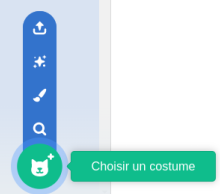
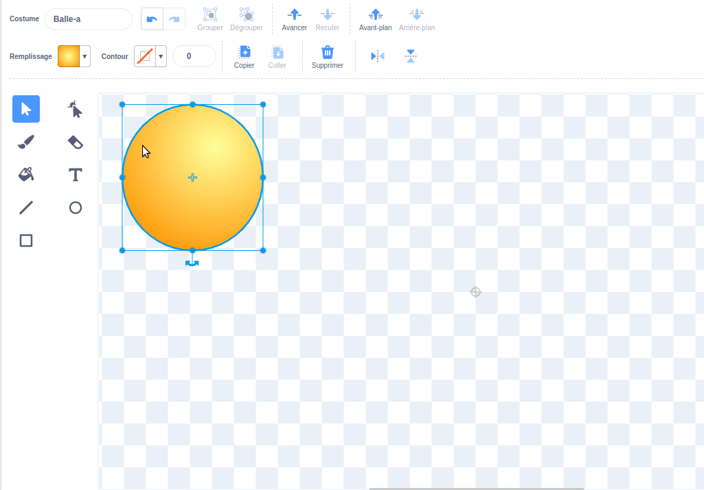
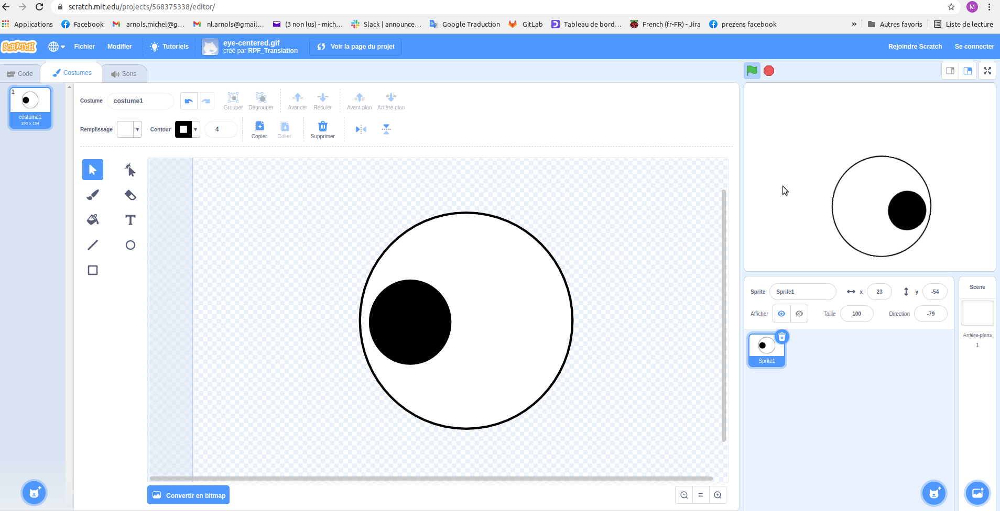
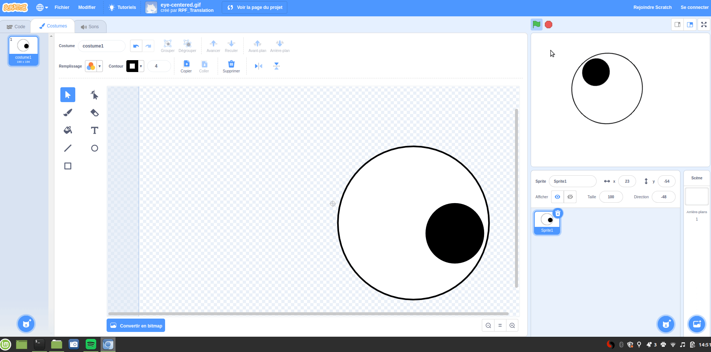

## Faire des yeux idiots

<div style="display: flex; flex-wrap: wrap">
<div style="flex-basis: 200px; flex-grow: 1; margin-right: 15px;">
Make the silly eyes! Chaque œil doit être un sprite séparé afin qu'il puisse se déplacer séparément.

</div>
<div>


{:width="300px"}  

</div>
</div>

### Draw an eyeball

--- task ---

Utilise le **Peindre** pour créer un nouveau **sprite**.


L'éditeur de peinture s'ouvrira, ce qui te permettra de créer le costume de **globe oculaire**.

--- /task ---

Il est vraiment important que :
- La pupille noire et l'iris coloré fassent face à droite du costume **globe oculaire**
- Le **globe oculaire** soit centré

--- task ---

**Choisir :** Dessine un oeil **ou** commence à partir d'un sprite rond.


--- collapse ---
---
title : Dessine un oeil dans l'éditeur de peinture
---

Select the **Circle** tool.

To draw a perfect circle, press and hold the <kbd>Shift</kbd> key on the keyboard while you draw with the **Circle** tool. If you are using a tablet, try to get as close to a perfect circle as you can.

In this example, we set the **Outline** to black and the **Fill** colour of the eyeball to white:


Use the **Fill** and **Outline** colour choosers to choose colours. To make black, slide both the **Saturation** and **Brightness** to `0`. To make white, slide the **Saturation** to `0` and the **Brightness** to `100`.

 

Make sure that the eyeball is centred — move it so that the blue cross in the costume lines up with the grey crosshair in the Paint editor.


Draw a smaller perfect circle and position it on the right-hand side of the eyeball:


You could also draw circles inside circles, or use colour, to get different effects.

--- /collapse ---

--- collapse ---
---
title : Transforme un costume rond en globe oculaire
---

There are costumes in Scratch that you can edit to make silly eyes for your character.


Click on the **Choose a Costume** icon to see the library Scratch costumes.



Click on the costume you want to add to your sprite.

Use the Paint editor to change the costume. You could add circles, choose a different **Fill** colour, or remove parts of the costume to turn it into a silly eye.

Make sure that the eyeball is centred — move it so that the blue cross in the costume lines up with the grey crosshair in the Paint editor.



**Tip:** The black pupil and coloured iris need to be positioned on the right-hand side of the costume so that the **Eyeball** follows the mouse pointer.


--- /collapse ---

--- /task ---

--- task ---

Name your sprite `Eyeball` in the Sprite pane.


--- /task ---

--- task ---

Drag the **Eyeball** sprite to position it on the Stage, and change its size to fit your character.

--- /task ---

Now, make the eyeball look at the `mouse-pointer`{:class="block3motion"} so that the user can interact with your project.

<p style="border-left: solid; border-width:10px; border-color: #0faeb0; background-color: aliceblue; padding: 10px;">
<span style="color: #0faeb0">**User**</span> means the person using the project (not just making it), and <span style="color: #0faeb0">**user interaction**</span> is how the project reacts to the user doing things such as moving the mouse and clicking on the screen. 
</p>

### Code your eyeball

--- task ---

Add a script to `set the rotation style`{:class="block3motion"} to `all around`{:class="block3motion"} to make the eyeball `point towards the mouse pointer`{:class="block3motion"} `forever`{:class="block3control"}.

--- collapse ---
---
title: Faire un sprite pointé vers le pointeur de la souris
---

```blocks3
when flag clicked
set rotation style [all around v]
forever
point towards (mouse-pointer v)
end
```

--- /collapse ---

--- /task ---

### Add another eyeball

--- task ---

To add another eye, right-click (or on a tablet, tap and hold) on the **Eyeball** sprite in the Sprite list and choose **duplicate**.


[[[scratch3-duplicate-sprite]]]

--- /task ---

### Test your silly eyes

--- task ---

**Test:** Click on the green flag and test your project. Do the silly eyes follow your mouse pointer as you move the mouse around?

**Tip:** You don't have to keep the mouse pointer on the Stage. The eyes will follow your mouse pointer as you carry on coding in Scratch.

--- /task ---

--- task ---

**Debug:** You might find some bugs in your project that you need to fix. Here are some common bugs:

--- collapse ---
---
title : Les yeux ne bougent pas
---

Make sure that you have added the code to the **Eyeball** sprites and **clicked on the green flag**. Your code will not run until you click on the green flag.

--- /collapse ---

--- collapse ---
---
title : Les yeux pointent loin de la souris
---

In the **Eyeball** costumes, check that the pupil is on the right-hand side (past the blue cross in the middle of the costume).

The **Eyeball** sprites have the `all around`{:class="block3motion"} `rotation style`{:class="block3motion"}, so they can rotate in any direction.

When the **Eyeballs** rotate to `point towards`{:class="block3motion"} the `mouse-pointer`{:class="block3motion"}, the pupils will be closest to the mouse pointer.




--- /collapse ---

--- collapse ---
---
title : Les yeux sautent sur la scène
---

Check that the **Eyeball** costumes are centred. To centre a costume, drag the costume so that the blue cross in the costume lines up with the grey crosshair in the Paint editor.




--- /collapse ---

--- collapse ---
---
title : Le personnage est devant les yeux
---

When you drag a sprite to position it on the Stage, it moves in front of the other sprites.

To get your **character** sprite to stay at the `back`{:class="block3looks"}, use:

```blocks3
when green flag clicked
forever
go to [back v] layer // behind all other sprites
```

--- /collapse ---

--- collapse ---
---
title : Le personnage et les yeux suivent le pointeur de la souris
---

Did you add the eyes as costumes for your **character** instead of as costumes for separate sprites? You can fix that.

One way to fix it is to duplicate the **character** sprite and then rename the copy `Eyeball`. Then, delete the **Eyeball** costumes from the **character** sprite, and delete the **character** costumes from the **Eyeball** sprite. Then, you can duplicate the **Eyeball** sprite and name the copy `Eyeball 2`.

The code to `point towards`{:class="block3motion"} the `mouse-pointer`{:class="block3motion"} should be on the **Eyeball** sprites and not the **character** sprite.

--- /collapse ---

--- collapse ---
---
title : Le personnage suit le pointeur de la souris (et pas les yeux)
---

You need to add the `point towards`{:class="block3motion"} code to the individual **Eyeball** sprites, not your **character** sprite!

To copy the code, you can drag the code from the Code area for your **character** to the **Eyeball** sprites in the Sprite list.

You will also need to delete the script from the **character** sprite. To do this, drag the script to the Blocks menu.

--- /collapse ---

You might find a bug that is not listed here. Can you work out how to fix it?

We love hearing about your bugs and how you fixed them. Use the **Send feedback** button at the bottom of this page and tell us if you found a different bug in your project.

--- /task ---
