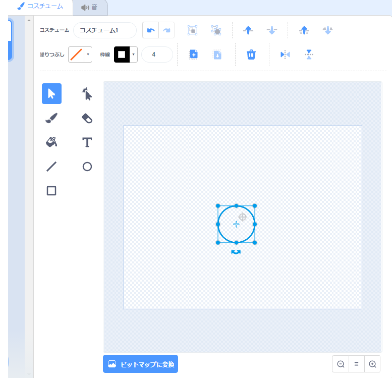
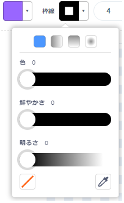
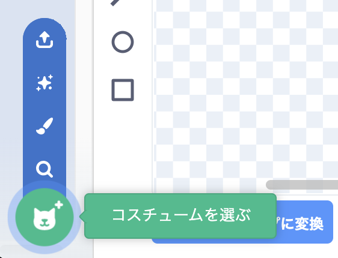
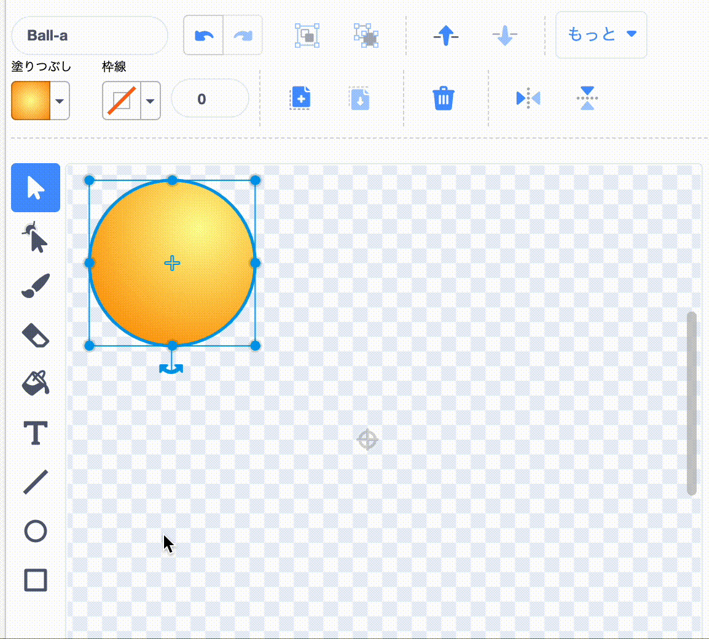
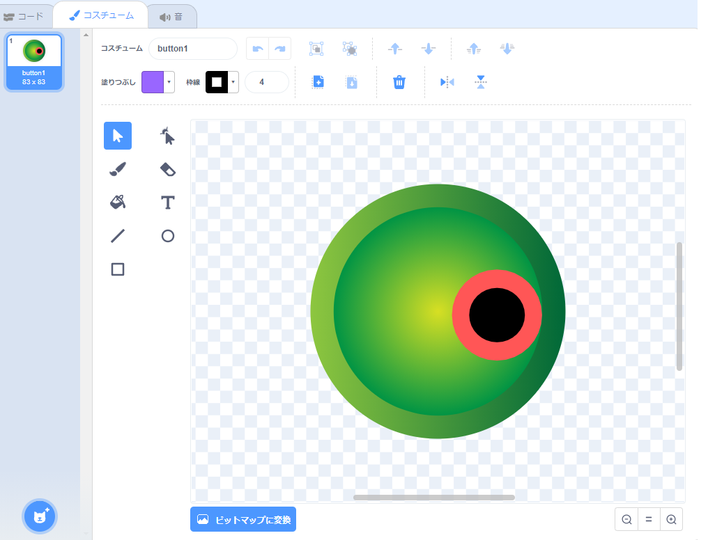
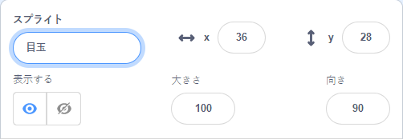
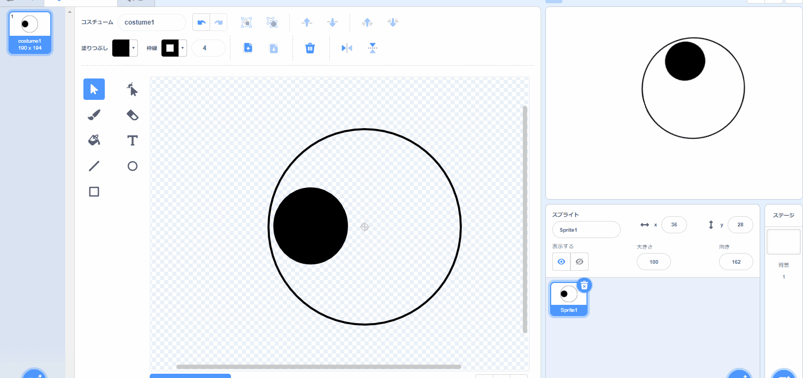
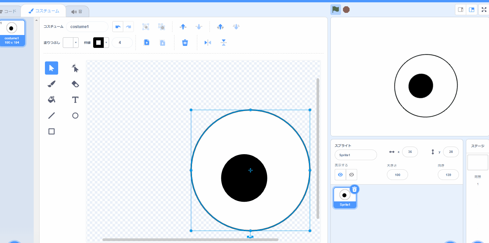

## おかしな目をつくる

<div style="display: flex; flex-wrap: wrap">
<div style="flex-basis: 200px; flex-grow: 1; margin-right: 15px;">
おかしな目を作ろう！ 別々に動くことができるように、各目は別々のスプライトである必要があります。

</div>
<div>


{:width="300px"}  

</div>
</div>

### 目を描こう！

--- task ---

**描く** オプションを使用して、新しい **スプライト**を作成します。


ペイントエディタが開くと、 **目玉** スプライトのコスチュームを作成できるようになります。

--- /task ---

以下のことはとても重要です：
- 黒い瞳孔と色付きの虹彩が**目玉** コスチュームの右側に面していること
- **目玉** コスチュームが中央に配置されていること

--- task ---

**選択：** 目玉を描くか **または** 丸いスプライトから始めます。


--- collapse ---
---
title: ペイントエディタで目玉を描く
---

**円** ツールを選択します。

真円を描くためには、キーボードの <kbd>シフト</kbd>キーを、**円** ツールで描いている間ずっと押したままにします 。 タブレットを使用している場合は、できるだけ完全な円に近づけるようにしてください。

この例では、**枠線** を黒に設定し、 **塗りつぶし** 色を白に設定します。



色を選択するには、 **塗りつぶし** および **枠線**の カラー選択を使用します。 黒色にするには、**鮮やかさ** と **明るさ**のスライドを `0`にします。 白色にするには、 **鮮やかさ**のスライドを `0`に、 **明るさ**のスライドを `100`にします。

 

目玉が中央にあることを確認します—コスチュームの青い十字がペイントエディタの灰色の十字線と揃うように目玉を動かします。


小さい真円を描き、それを目玉の右側に配置します。


また、円の内側に円を描いたり、色を使用してさまざまな効果を得ることができます。

--- /collapse ---

--- collapse ---
---
title: 丸いコスチュームを目玉に変える
---

Scratchには、キャラクターのおかしな目を作るために編集できるコスチュームがあります。


**コスチュームを選ぶ** アイコンをクリックして、Scratch コスチュームの一覧を表示します。



スプライトに追加したいコスチュームをクリックします。

ペイントエディタを使用してコスチュームを変更します。 円を追加したり、別の **塗りつぶし** 色を選択したり、コスチュームの一部を削除しておかしな目にしたりすることができます。

目玉が中央にあることを確認します—コスチュームの青い十字がペイントエディタの灰色の十字線と揃うように目玉を動かします。



**ヒント:** 黒い瞳孔と色付きの虹彩は、 **目玉** がマウス ポインタに追従するように、コスチュームの右側に配置する必要があります。



--- /collapse ---

--- /task ---

--- task ---

スプライトペインで 名前を`目玉` にします。



--- /task ---

--- task ---

**目玉** スプライトをドラッグしてステージに配置し、キャラクターに合わせてサイズを変更します。

--- /task ---

では、目玉が`マウスポインタ`{:class="block3motion"}を見るようにしてみましょう。

<p style="border-left: solid; border-width:10px; border-color: #0faeb0; background-color: aliceblue; padding: 10px;">
<span style="color: #0faeb0">**ユーザー**</span> は(プロジェクトを作成するだけでなく) プロジェクトを使用する人を意味し、 <span style="color: #0faeb0">ユーザーインタラクション**</span> は、マウスを動かしたり画面をクリックしたりするユーザーにプロジェクトがどのように反応するかを意味します。 
</p>

### 目に対するコードを書きましょう

--- task ---

目玉を`ずっと`{:class="block3control"} `マウスポインターへ向ける`{:class="block3motion"}ように、 `回転方向を[・・・v]にする`{:class="block3motion"} を `自由に回転`{:class="block3motion"} にするスクリプトを追加します。

--- collapse ---
---
title: スプライトがマウスポインターを追うようにする
---

```blocks3
when flag clicked
set rotation style [all around v]
forever
point towards (mouse-pointer v)
end
```

--- /collapse ---

--- /task ---

### もう一つの目を追加しよう

--- task ---

もう一つの目を追加するには、スプライトリストの **目玉** スプライトを右クリック（またはタブレットではタップアンドホールド）し、 **複製** を選択します。


[[[scratch3-duplicate-sprite]]]

--- /task ---

### 作ったおかしな目をテストしよう

--- task ---

**テスト：** 緑色の旗をクリックして、プロジェクトをテストします。 あなたがマウスを動かしているとき、おかしな目はあなたのマウスポインタを追いますか？

**ヒント：** マウスポインターをステージ上だけで動かす必要はありません。 Scratchのコードエリアに移動しても、目玉はマウスポインタを追いかけます。

--- /task ---

--- task ---

**デバッグ：** プロジェクトに修正が必要なバグが見つかる場合があります。 一般的なバグは次のとおりです。

--- collapse ---
---
タイトル：目玉が動かない
---

**目玉** スプライトにコードを追加し、 **緑色のフラグをクリックした**ことを確認します。 緑の旗をクリックするまで、コードは実行されません。

--- /collapse ---

--- collapse ---
---
タイトル：目玉がマウスから離れた方向を向いています
---

**目玉** コスチュームで、瞳孔が（コスチュームの真ん中にある青い十字を過ぎて）右側にあることを確認します。

**目玉** スプライトは、 `回転方法`{:class="block3motion"}を `自由に回転`{:class="block3motion"}するようにしているので、任意の方向に回転できます。

**目玉**が`マウスのポインター`{:class="block3motion"}`に向ける`{:class="block3motion"}回転をすると、瞳孔はマウスポインターに最も近くなります。




--- /collapse ---

--- collapse ---
---
title: 目がステージを飛び回る
---

**目玉**コスチュームが中心にあることを確認してください。 コスチュームを中央に配置するには、コスチュームをドラッグして、コスチュームの青い十字がペイントエディタの灰色の十字線と揃うようにします。




--- /collapse ---

--- collapse ---
---
title: キャラクターが目より前面にある
---

スプライトをドラッグしてステージに配置すると、他のスプライトの前面に来ます。

**キャラクター** のスプライトを `最背面`{:class="block3looks"}にとどめるには、次を使用します。

```blocks3
when green flag clicked
forever
go to [back v] layer // behind all other sprites
```

--- /collapse ---

--- collapse ---
---
title: キャラクターと目玉が一緒にマウスポインターを追う
---

別のスプライトのコスチュームとしてではなく あなたの**キャラクター** コスチュームとして目を追加しましたか？ こうすればできます。

それを解決する一つの方法としては、 **キャラクター** スプライトを複製してから コピーしたスプライトの名前を`目玉`に変えます。 次に、 **キャラクター** スプライトから **目玉** コスチュームを削除し、 **目玉**スプライトから **キャラクター** コスチュームを削除します。 それから、 **目玉** スプライトをコピーして、名前を `目玉2`にします。

`マウスのポインター`{:class="block3motion"}`へ向ける`{:class="block3motion"}コードは **目玉** スプライトに書かれ、 **キャラクター** スプライトには書かないようにします。

--- /collapse ---

--- collapse ---
---
title: キャラクターはマウスポインタを追いかけます（目玉は追いかけません）
---

マウスポインター`へ向ける`{:class="block3motion"}コードはそれぞれの **目玉** スプライトにだけ追加します。 **キャラクター** スプライトには追加してはいけません!

コードをコピーするには、 **キャラクター** コード領域からスプライトリストにある **目玉**スプライトにコードをドラッグします。

**キャラクター** のスプライトからスクリプトを削除する必要があります。 これを行うには、スクリプトを[ブロック] メニューにドラッグします。

--- /collapse ---

ここに記載されていないバグが見つかる可能性があります。 あなたはそれを修正する方法を見つけることができますか？

私たちはあなたのバグと、あなたがそれらをどのように修正したかについて教えてほしいです。 プロジェクトで別のバグを見つけた場合、このページの一番下にある**フィードバックを送信** ボタンを使ってお知らせください。

--- /task ---
