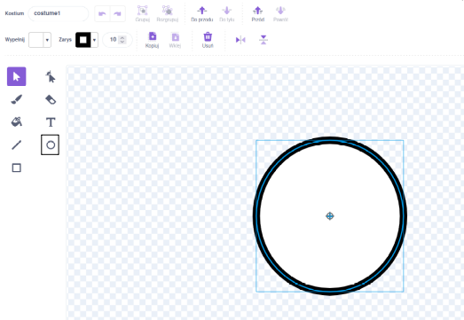
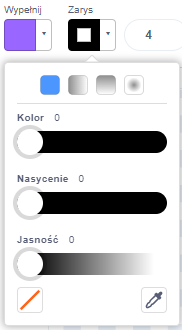
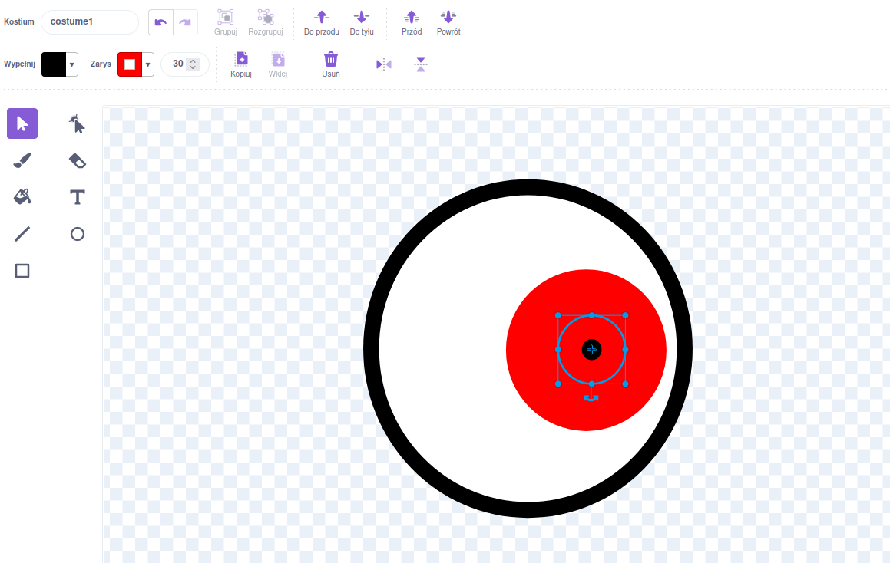
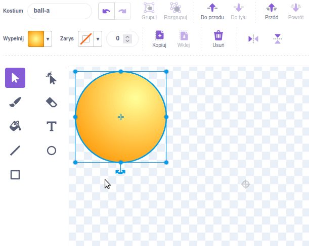
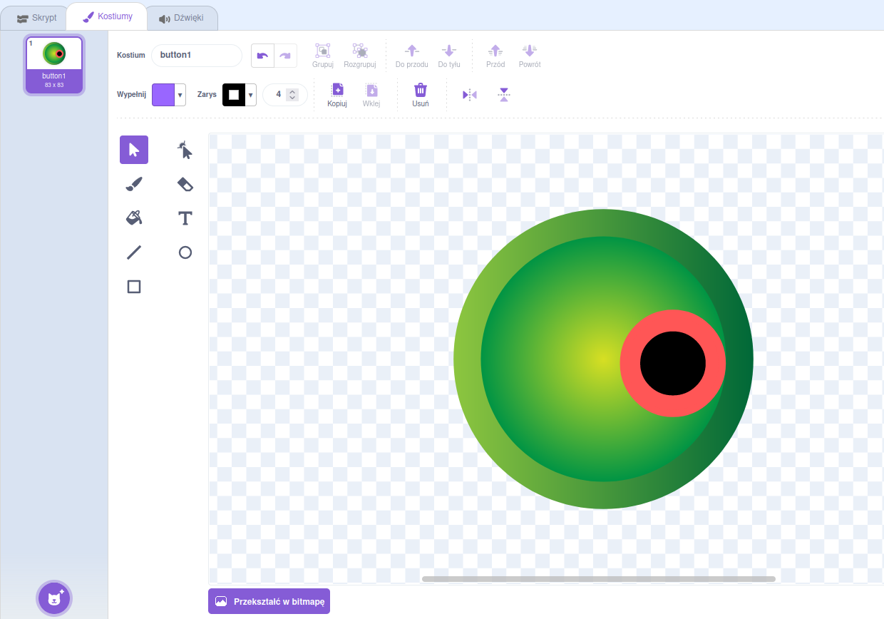
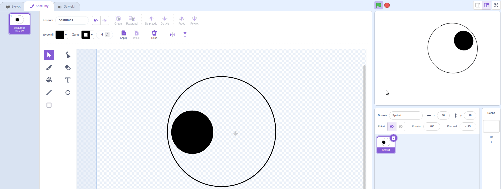
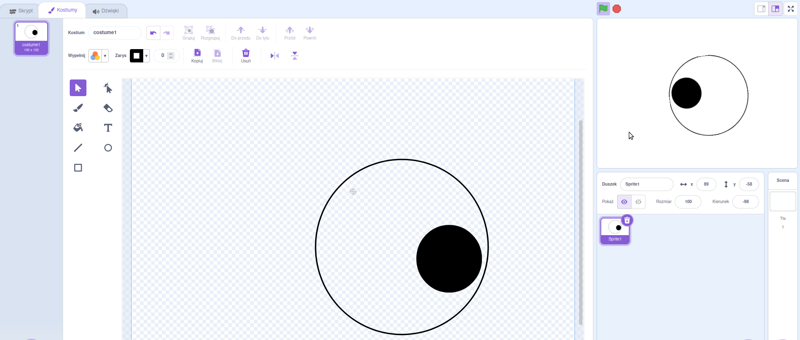

## Zrób śmieszne oczy

<div style="display: flex; flex-wrap: wrap">
<div style="flex-basis: 200px; flex-grow: 1; margin-right: 15px;">
Zrób śmieszne oczy! Każde oko musi być osobnym duszkiem, aby mogły się poruszać niezależnie.

</div>
<div>


{:width="300px"}  

</div>
</div>

### Narysuj gałkę oczną

--- task ---

Użyj opcji **Maluj**, aby utworzyć nowego **duszka**.


Otworzy się edytor Paint, który pozwoli ci stworzyć kostium Twojego duszka **Oko**.

--- /task ---

Bardzo ważne jest, aby:
- Czarna źrenica i kolorowa tęczówka były skierowane w prawą stronę kostiumu **Oko**
- Kostium **Oko** był wyśrodkowany

--- task ---

**Wybierz:** Narysuj gałkę oczną **lub** zacznij od okrągłego duszka.


--- collapse ---
---
title: Narysuj gałkę oczną w edytorze Paint
---

Wybierz narzędzie **Okrąg**.

Aby narysować idealne koło, naciśnij i przytrzymaj klawisz <kbd>Shift</kbd> na klawiaturze podczas rysowania za pomocą narzędzia **Okrąg**. Jeśli używasz tabletu, spróbuj jak najbardziej zbliżyć się kształtem do idealnego okręgu.

W tym przykładzie ustawiamy kolor **Zarys** na czarny, a kolor **Wypełnij** na biały:



Skorzystaj z okienek wyboru koloru dla **Wypełnij** i **Zarys** aby wybrać kolory. Aby uzyskać czerń, ustaw zarówno **Nasycenie** jak i **Jasność** na `0`. Aby uzyskać biel, ustaw **Nasycenie** na `0` i **Jasność** na `100`.

 

Upewnij się, że gałka oczna jest wyśrodkowana — przesuń ją tak, aby niebieski krzyżyk w kostiumie zrównał się z szarym celownikiem w edytorze Paint.


Narysuj mniejsze, również idealne koło i umieść je po prawej stronie gałki ocznej:



Możesz także narysować koła wewnątrz innych kół lub użyć koloru, aby uzyskać różne efekty.

--- /collapse ---

--- collapse ---
---
title: Zamień okrągły kostium w gałkę oczną
---

W Scratch znajdują się kostiumy, które możesz edytować, aby zrobić oczy dla swojej postaci.


Kliknij ikonę **Wybierz kostium**, aby zobaczyć bibliotekę kostiumów Scratch.


Kliknij kostium, który chcesz dodać do Twojego duszka.

Użyj edytora Paint, aby zmodyfikować kostium. Możesz dodać kółka, wybrać inny kolor w polu **Wypełnij** lub usunąć części kostiumu, aby zmienić go w śmieszne oko.

Upewnij się, że gałka oczna jest wyśrodkowana — przesuń ją tak, aby niebieski krzyżyk w kostiumie zrównał się z szarym celownikiem w edytorze Paint.



**Wskazówka:** Czarna źrenica i kolorowa tęczówka muszą być umieszczone po prawej stronie kostiumu tak, aby **Oko** podążało za kursorem myszy.



--- /collapse ---

--- /task ---

--- task ---

Nazwij swojego duszka `Oko` w panelu Duszka.


--- /task ---

--- task ---

Przeciągnij duszka **Oko** aby umieścić go na scenie, i zmień jego rozmiar, aby dopasować go do swojej postaci.

--- /task ---

Teraz spraw, aby oko patrzyło na `wskaźnik myszy`{:class="block3motion"}, aby użytkownik mógł wchodzić w interakcję z Twoim projektem.

<p style="border-left: solid; border-width:10px; border-color: #0faeb0; background-color: aliceblue; padding: 10px;">
<span style="color: #0faeb0">**Użytkownik**</span> oznacza osobę korzystającą z projektu (a nie tylko go tworzącą), a <span style="color: #0faeb0">**interakcja z użytkownikiem**</span> to reakcja projektu na wykonywanie przez użytkownika takich czynności, jak poruszanie myszą i klikanie na ekranie. 
</p>

### Zakoduj swoje oko

--- task ---

Dodaj skrypt, aby `ustawić styl obrotu na`{:class="block3motion"} `dookoła`{:class="block3motion"}, dzięki czemu oko będzie `zawsze`{:class="block3control"} `ustawione w kierunku duszka wskaźnik myszy`{:class="block3motion"}.

--- collapse ---
---
title: Spraw, aby duszek był skierowany w kierunku wskaźnika myszy
---

```blocks3
when flag clicked
set rotation style [all around v]
forever
point towards (mouse-pointer v)
end
```

--- /collapse ---

--- /task ---

### Dodaj kolejne oko

--- task ---

Aby dodać kolejne oko, kliknij prawym przyciskiem myszy (lub na tablecie dotknij i przytrzymaj) duszka **Oko** na liście duszków i wybierz **duplikuj**.


[[[scratch3-duplicate-sprite]]]

--- /task ---

### Przetestuj swoje śmieszne oczy

--- task ---

**Test:** Kliknij zieloną flagę i przetestuj swój projekt. Czy głupkowate oczy podążają wzrokiem za wskaźnikiem myszy, gdy nim poruszasz?

**Wskazówka:** Wskaźnik myszy nie musi znajdować się tylko na scenie. Oczy będą podążać wzrokiem za wskaźnikiem myszy podczas kodowania w Scratchu.

--- /task ---

--- task ---

**Debugowanie:** Być może znajdziesz błędy w swoim projekcie, które musisz naprawić. Oto kilka częstych błędów:

--- collapse ---
---
title: Oczy się nie poruszają
---

Upewnij się, że kod został dodany do duszków **Oko** i, że **zielona flaga została kliknięta**. Twój kod nie zostanie uruchomiony, dopóki nie klikniesz zielonej flagi.

--- /collapse ---

--- collapse ---
---
title: Oczy są odwrócone od wskaźnika myszy
---

W kostiumach duszka **Oko** sprawdź, czy źrenica znajduje się po prawej stronie (za niebieskim krzyżykiem na środku kostiumu).

Duszki **Oko** mają ustawiony `styl obrotu na`{:class="block3motion"} `dookoła`{:class="block3motion"}, więc mogą obracać się w dowolnym kierunku.

Kiedy duszki **Oko** obracają się, aby `ustawić się w kierunku duszka`{:class="block3motion"} `wskaźnik myszy`{:class="block3motion"}, źrenice będą najbliżej wskaźnika myszy.




--- /collapse ---

--- collapse ---
---
title: Oczy skaczą po scenie
---

Sprawdź, czy kostium duszka **Oko** jest wyśrodkowany. Aby wyśrodkować kostium, przeciągnij go tak, aby niebieski krzyżyk w kostiumie zrównał się z szarym krzyżykiem w edytorze Paint.




--- /collapse ---

--- collapse ---
---
title: Postać jest przed oczami
---

Kiedy przeciągasz duszka w celu umieszczenia go na scenie, ustawia się on przed innymi duszkami.

Aby duszek Twojej **postaci** pozostał `na spodzie`{:class="block3looks"}, użyj:

```blocks3
when green flag clicked
forever
go to [back v] layer // behind all other sprites
```

--- /collapse ---

--- collapse ---
---
title: Postać i oczy podążają za wskaźnikiem myszy
---

Czy oczy nie zostały przypadkiem dodane jako kostiumy dla Twojej **postaci** zamiast jako kostiumy dla oddzielnych duszków? Jeśli tak, możesz to naprawić.

Jednym ze sposobów rozwiązania tego problemu jest zduplikowanie duszka **postaci**, a następnie zmiana nazwy kopii na `Oko`. Następnie usuń kostiumy **Oko** z duszka **postaci** i usuń kostiumy **postaci** z duszka **Oko**. Następnie możesz zduplikować duszka **Oko** i nazwać kopię `Oko 2`.

Kod służący do `ustawiania się w kierunku duszka`{:class="block3motion"} `wskaźnik myszy `{:class="block3motion"} powinien znajdować się w duszkach **Oko**, a nie w duszku **postaci**.

--- /collapse ---

--- collapse ---
---
title: Postać podąża za wskaźnikiem myszy (a oczy nie)
---

Musisz dodać polecenie `ustaw w kierunku duszka`{:class="block3motion"} do poszczególnych duszków **Oko**, a nie duszka Twojej **postaci**!

Aby skopiować kod, możesz przeciągnąć kod z obszaru kodu swojej **postaci** do duszków **Oko** na liście duszków.

Trzeba będzie także usunąć skrypt z duszka **postaci**. Aby to zrobić, przeciągnij skrypt do menu z blokami.

--- /collapse ---

Możesz też znaleźć błąd, który nie został tutaj wymieniony. Może wymyślisz, jak go naprawić?

Uwielbiamy dowiadywać się o napotkanych przez Ciebie błędach i wymyślonych przez Ciebie sposobach poradzenia sobie z nimi. Użyj przycisku **Prześlij opinię** na dole tej strony i poinformuj nas, czy w Twoim projekcie pojawił się inny błąd.

--- /task ---
