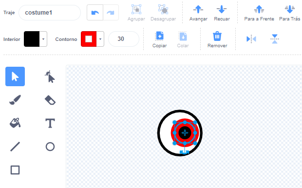
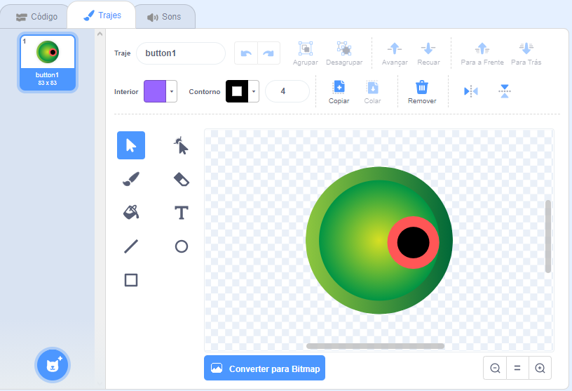
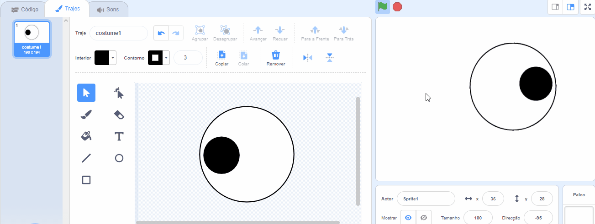

## Faça olhos bobos

<div style="display: flex; flex-wrap: wrap">
<div style="flex-basis: 200px; flex-grow: 1; margin-right: 15px;">
Nesta etapa, você vai fazer os olhos bobos! Cada olho precisa ser um ator separado para que possa se mover separadamente.

Se precisar de ajuda, veja as dicas na tarefa ** Depurar ** na parte inferior desta etapa.
</div>
<div>

! [Um personagem com olhos engraçados.](Images/character-with-eyes.png)
{:width="300px"}  

</div>
</div>

--- task ---

Use a **Pintura** para criar um novo **ator**.


O editor de pintura será aberto, o que permitirá que você crie a fantasia do ator **Bola do olho**.

--- /task ---

É muito importante que:
- A pupila preta e a íris colorida estão voltadas para o lado direito da fantasia **Bola do olho**
- A **Bola do olho** está centralizado

--- task ---

**Escolha:** Desenhe um globo ocular **ou** começando de um ator redondo.

--- collapse ---
---
title: Desenhe um globo ocular no editor de pintura
---

Selecione a ferramenta **Círculo**.

Para desenhar um círculo perfeito, pressione e segure a tecla <kbd>Shift</kbd> no teclado enquanto desenha com a ferramenta **Círculo**. Se você estiver usando um tablet, tente chegar o mais perto possível de um círculo perfeito.

Neste exemplo, definimos **Linha externa** para preto e o **Preenchimento** do globo ocular para branco:


Use o **Preenchimento** e **Linha externa** para escolher as cores. Para tornar preto, deslize **Saturação** e **Brilho** a `0`. Para tornar preto, deslize **Saturação** para`0` e o **Brilho** para `100`.

 

Certifique-se de que o globo ocular esteja centralizado - mova-o de forma que a cruz azul na fantasia se alinhe com a cruz cinza no editor de pintura.

Desenhe um círculo perfeito menor e posicione-o no lado direito do globo ocular:



Você também pode desenhar círculos dentro de círculos ou usar cores para obter efeitos diferentes.

--- /collapse ---


--- collapse ---
---
title: Transforme uma fantasia redonda em um globo ocular
---

Existem fantasias no Scratch que você pode editar para fazer olhos bobos para o seu personagem.

Use o editor de pintura para mudar uma roupa. Você pode adicionar círculos, escolher um **Preenchimento** diferente ou remover partes do traje para transformá-lo em um olho bobo.

**Dica:** Você precisará centralizar a **Bola do olho** no editor de pintura para que ele gire suavemente ao girar. Use a cruz para centralizar a fantasia. A pupila preta e a íris colorida precisam ser posicionadas do lado direito da roupa para que a **Bola do olho** siga o ponteiro do mouse.




--- /collapse ---

--- /task ---

--- task ---

Nomeie seu ator como `Bola do olho` no painel Ator.


--- /task ---

--- task ---

Arraste a **Bola do olho** para posicioná-la no Palco e altere seu tamanho para se ajustar ao seu personagem.

--- /task ---

Agora, faça o globo ocular olhar para o ponteiro do mouse ``{:class="block3motion"}.

--- task ---

Adicione um script para `definir o estilo de rotação`{:class="block3motion"} para `ao redor de`{:class="block3motion"} para fazer o globo ocular `apontar para o ponteiro do mouse`{:class="block3motion"} `para sempre`{:class="block3control"}.

--- collapse ---
---
title: Faça um ator apontar para o ponteiro do mouse
---

```blocks3
when flag clicked
set rotation style [all around v]
forever
point towards (mouse-pointer v)
end
```

--- /collapse ---

--- /task ---


Se seu personagem tiver apenas um olho, você terminou.

--- task ---

Caso contrário, clique com o botão direito (se estiver usando um tablet, toque e segure) na **Bola do olho** na lista de Atores e escolha **duplicatas** para criar mais olhos engraçados.

[[[scratch3-duplicate-sprite]]]

--- /task ---

--- task ---

**Teste:** Clique na bandeira verde e assista à animação. Os olhos bobos seguem o ponteiro do mouse enquanto você move o mouse?

**Dica:** Você não precisa manter o ponteiro do mouse no Palco. Os olhos seguirão o ponteiro do mouse enquanto você codifica no Scratch.

--- /task ---

--- task ---

**Depurar:** Você pode encontrar alguns bugs em seu projeto que precisam ser corrigidos. Aqui estão alguns bugs comuns:

--- collapse ---
---
title: Os olhos não se movem
---

Certifique-se de ter adicionado o código aos atores **Bola do olho** **clicar na bandeira verde**. Your code will not run until you click on the green flag.

--- /collapse ---

--- collapse ---
---
title: The eyes point away from the mouse
---

In the **Eyeball** costumes, check that the pupil is on the right-hand side (past the blue cross in the middle of the costume).

The **Eyeball** sprites have the `all around`{:class="block3motion"} `rotation style`{:class="block3motion"}, so they can rotate in any direction.

When the **Eyeballs** rotate to `point towards`{:class="block3motion"} the `mouse-pointer`{:class="block3motion"}, the pupils will be closest to the mouse pointer.




--- /collapse ---

--- collapse ---
---
title: The eyes jump around the Stage
---

Check that the **Eyeball** costumes are centred. To centre a costume, drag the costume so that the blue cross in the costume lines up with the grey crosshair in the Paint editor.


--- /collapse ---

--- collapse ---
---
title: The character is in front of the eyes
---

When you drag a sprite to position it on the Stage, it moves in front of the other sprites.

To get your **character** sprite to stay at the `back`{:class="block3looks"}, use:

```blocks3
when green flag clicked
forever
go to [back v] layer // behind all other sprites
```

--- /collapse ---

--- collapse ---
---
title: The character and the eyes follow the mouse pointer
---

Did you add the eyes as costumes for your **character** instead of as costumes for separate sprites? You can fix that.

One way to fix it is to duplicate the **character** sprite and then rename the copy `Eyeball`. Then, delete the **Eyeball** costumes from the **character** sprite, and delete the **character** costumes from the **Eyeball** sprite. Then, you can duplicate the **Eyeball** sprite and name the copy `Eyeball 2`.

The code to `point towards`{:class="block3motion"} the `mouse-pointer`{:class="block3motion"} should be on the **Eyeball** sprites and not the **character** sprite.

--- /collapse ---

--- collapse ---
---
title: The character follows the mouse pointer (and the eyes do not)
---

You need to add the `point towards`{:class="block3motion"} code to the individual **Eyeball** sprites, not your **character** sprite!

To copy the code, you can drag the code from the Code area for your **character** to the **Eyeball** sprites in the Sprite list.

You will also need to delete the script from the **character** sprite. To do this, drag the script to the Blocks menu.

--- /collapse ---

You might find a bug that is not listed here. Can you work out how to fix it?

We love hearing about your bugs and how you fixed them. Use the **Send feedback** button at the bottom of this page and tell us if you found a different bug in your project.


--- /task ---

--- save ---
