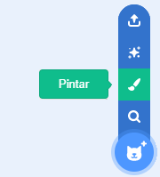
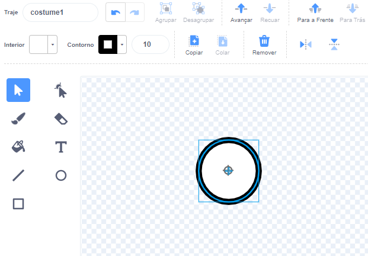
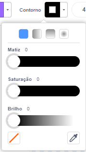
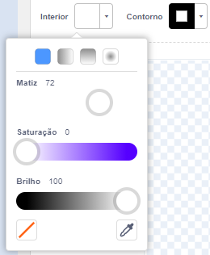
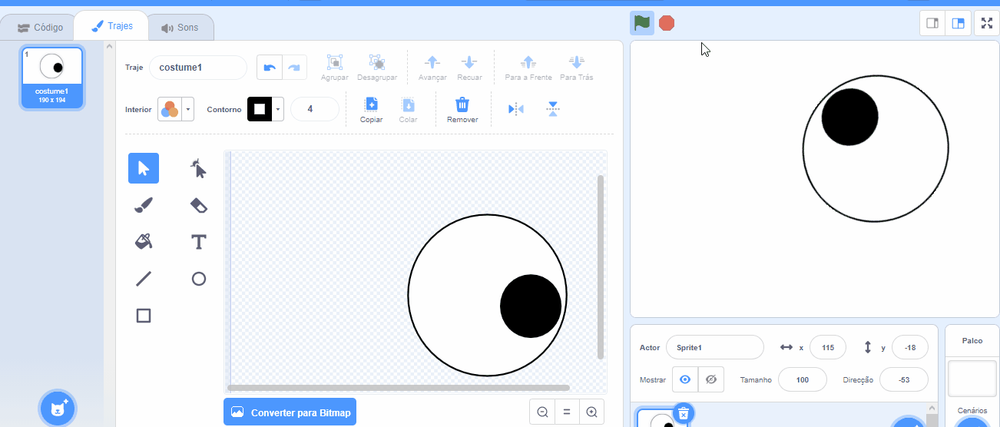

## Faça olhos bobos

<div style="display: flex; flex-wrap: wrap">
<div style="flex-basis: 200px; flex-grow: 1; margin-right: 15px;">
Nesta etapa, você vai fazer os olhos bobos! Cada olho precisa ser um ator separado para que possa se mover separadamente.

Se precisar de ajuda, veja as dicas na tarefa **Depurar** na parte inferior desta etapa.
</div>
<div>

{:width="300px"}  

</div>
</div>

--- task ---

Use a **Pintura** para criar um novo **ator**.



O editor de pintura será aberto, o que permitirá que você crie a fantasia do ator **Bola do olho**.

--- /task ---

É muito importante que:
- A pupila preta e a íris colorida estão voltadas para o lado direito da fantasia **Bola do olho**
- A **Bola do olho** está centralizado

--- task ---

**Escolha:** Desenhe um globo ocular **ou** começando de um ator redondo.

--- collapse ---
---
title: Desenhe um globo ocular no editor de pintura
---

Selecione a ferramenta **Círculo**.

Para desenhar um círculo perfeito, pressione e segure a tecla <kbd>Shift</kbd> no teclado enquanto desenha com a ferramenta **Círculo**. Se você estiver usando um tablet, tente chegar o mais perto possível de um círculo perfeito.

Neste exemplo, definimos **Linha externa** para preto e o **Preenchimento** do globo ocular para branco:



Use o **Preenchimento** e **Linha externa** para escolher as cores. Para tornar preto, deslize **Saturação** e **Brilho** a `0`. Para tornar preto, deslize **Saturação** para `0` e o **Brilho** para `100`.

 

Certifique-se de que o globo ocular esteja centralizado - mova-o de forma que a cruz azul na fantasia se alinhe com a cruz cinza no editor de pintura.

Desenhe um círculo perfeito menor e posicione-o no lado direito do globo ocular:


Você também pode desenhar círculos dentro de círculos ou usar cores para obter efeitos diferentes.

--- /collapse ---


--- collapse ---
---
title: Transforme uma fantasia redonda em um globo ocular
---

Existem fantasias no Scratch que você pode editar para fazer olhos bobos para o seu personagem.

Use o editor de pintura para mudar uma roupa. Você pode adicionar círculos, escolher um **Preenchimento** diferente ou remover partes do traje para transformá-lo em um olho bobo.

**Dica:** Você precisará centralizar a **Bola do olho** no editor de pintura para que ele gire suavemente ao girar. Use a cruz para centralizar a fantasia. A pupila preta e a íris colorida precisam ser posicionadas do lado direito da roupa para que a **Bola do olho** siga o ponteiro do mouse.


--- /collapse ---

--- /task ---

--- task ---

Nomeie seu ator como `Bola do olho` no painel Ator.


--- /task ---

--- task ---

Arraste a **Bola do olho** para posicioná-la no Palco e altere seu tamanho para se ajustar ao seu personagem.

--- /task ---

Agora, faça o globo ocular olhar para o `ponteiro do mouse`{:class="block3motion"}.

--- task ---

Adicione um script para `definir o estilo de rotação`{:class="block3motion"} para `ao redor de`{:class="block3motion"} para fazer o globo ocular `apontar para o ponteiro do mouse`{:class="block3motion"} `para sempre`{:class="block3control"}.

--- collapse ---
---
title: Faça um ator apontar para o ponteiro do mouse
---

```blocks3
when flag clicked
set rotation style [all around v]
forever
point towards (mouse-pointer v)
end
```

--- /collapse ---

--- /task ---


Se seu personagem tiver apenas um olho, você terminou.

--- task ---

Caso contrário, clique com o botão direito (se estiver usando um tablet, toque e segure) na **Bola do olho** na lista de Atores e escolha **duplicatas** para criar mais olhos engraçados.

[[[scratch3-duplicate-sprite]]]

--- /task ---

--- task ---

**Teste:** Clique na bandeira verde e assista à animação. Os olhos bobos seguem o ponteiro do mouse enquanto você move o mouse?

**Dica:** Você não precisa manter o ponteiro do mouse no Palco. Os olhos seguirão o ponteiro do mouse enquanto você codifica no Scratch.

--- /task ---

--- task ---

**Depurar:** Você pode encontrar alguns bugs em seu projeto que precisam ser corrigidos. Aqui estão alguns bugs comuns:

--- collapse ---
---
title: Os olhos não se movem
---

Certifique-se de ter adicionado o código aos atores **Bola do olho** **clicar na bandeira verde**. Seu código não será executado até que você clique na bandeira verde.

--- /collapse ---

--- collapse ---
---
title: Os olhos apontam para longe do mouse
---

Em **Bola do olho**, verifique se a pupila está do lado direito (além da cruz azul no meio da fantasia).

As **Bolas do olho** têm os `ao redor de`{:class="block3motion"} `estilo de rotação`{:class="block3motion"}, então eles podem girar em qualquer direção.

Quando as **Bolas do olho** gira para `pontos em direção a`{:class="block3motion"} o `ponteiro do mouse`{:class="block3motion"}, as pupilas estarão mais próximas do ponteiro do mouse.


--- /collapse ---

--- collapse ---
---
title: Os olhos saltam pelo palco
---

A **Bola do olho** está centralizado. Certifique-se de que o globo ocular esteja centralizado - mova-o de forma que a cruz azul na fantasia se alinhe com a cruz cinza no editor de pintura.




--- /collapse ---

--- collapse ---
---
title: O personagem está na frente dos olhos
---

Quando você arrasta um ator para posicioná-lo no Palco, ele se move na frente dos outros atores.

Para fazer com que seu ator **caractere** `vá para trás`{:class="block3looks"}, use:

```blocks3
when green flag clicked
forever
go to [back v] layer // atrás de todos os outros atores
```

--- /collapse ---

--- collapse ---
---
title: O personagem e os olhos seguem o ponteiro do mouse
---

Você adicionou os olhos como fantasias para seu **personagem** em vez de como fantasias para atores separados? Você pode fazer isso.

Uma maneira de consertar isso é duplicar o **caractere** e renomear a cópia `Bola do olho`. Em seguida, exclua as roupas **Bola do olho** dos **personagens** e exclua as roupas de **personagens** do ator **Bola do olho**. Uma maneira de consertar isso é duplicar o **caractere** e renomear a cópia `Bola do olho`.

O código para `aponta para`{:class="block3motion"} os `ponteiros do mouse`{:class="block3motion"} deve estar nos **Bola do olho dos atores** e não no ator de **caracteres**.

--- /collapse ---

--- collapse ---
---
title: O personagem segue o ponteiro do mouse (e os olhos não)
---

Você precisa adicionar a `direção a`{:class="block3motion"} código para os **atores do globo ocular** individuais, não seu ator de **caracteres**!

Para copiar o código, você pode arrastar o código da área de código do seu **personagem** para os atores do **globo ocular** na lista de Atores.

Você também precisará deletar o script do ator **caractere**. Para fazer isso, arraste o script para o menu Blocos.

--- /collapse ---

Você pode encontrar um bug que não está listado aqui. Você consegue descobrir como consertá-lo?

Adoraríamos saber sobre seus bugs e como você os corrigiu. Use o botão **Enviar comentários** na parte inferior desta página e nos diga se você encontrou um bug diferente em seu projeto.


--- /task ---

--- save ---
