## Gör roliga ögon

<div style="display: flex; flex-wrap: wrap">
<div style="flex-basis: 200px; flex-grow: 1; margin-right: 15px;">
Gör de roliga ögonen! Varje öga måste vara en separat sprajt så att den kan röra sig självständigt.

</div>
<div>


{:width="300px"}  

</div>
</div>

### Rita en ögonglob

--- task ---

Använd alternativet **Måla** för att skapa en ny **sprajt**.

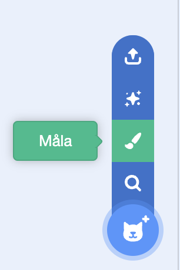

Målarredigeraren öppnas, vilket gör att du kan skapa din **ögonglob**sprajts klädsel.

--- /task ---

Det är verkligen viktigt att:
- Den svarta pupillen och den färgade irisen är vända mot den högra sidan av **ögongloben**klädseln
- **Ögonglob**klädseln är centrerad

--- task ---

**Välj:** Rita en ögonglob **eller** börja med en rund sprajt.

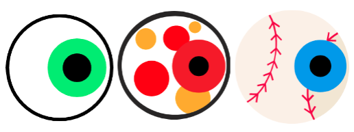

--- collapse ---
---
title: Rita en ögonglob i målarredigeraren
---

Välj **Cirkel**-verktyget.

För att rita en perfekt cirkel, tryck och håll ned <kbd>Shift</kbd>-tangenten på tangentbordet medan du ritar med **Cirkel**verktyget. Försök att komma så nära en perfekt cirkel som du kan om du använder en surfplatta.

I det här exemplet ställer vi in **Kontur** till svart och **Fyll**-färgen på ögongloben till vit:

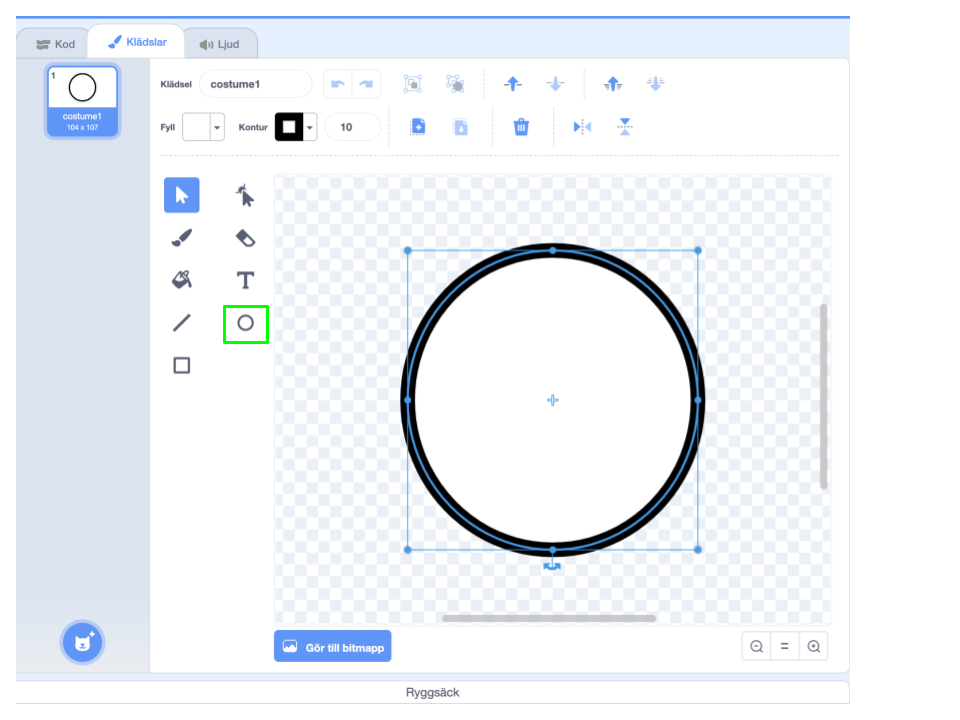

Använd färgväljarna **Fyll** och **Kontur** för att välja färger. För att skapa svart, skjut både **Mättnad** och **Ljusstyrka** till `0`. För att skapa vit, skjut **Mättnad** till `0` och **Ljusstyrka** till `100`.

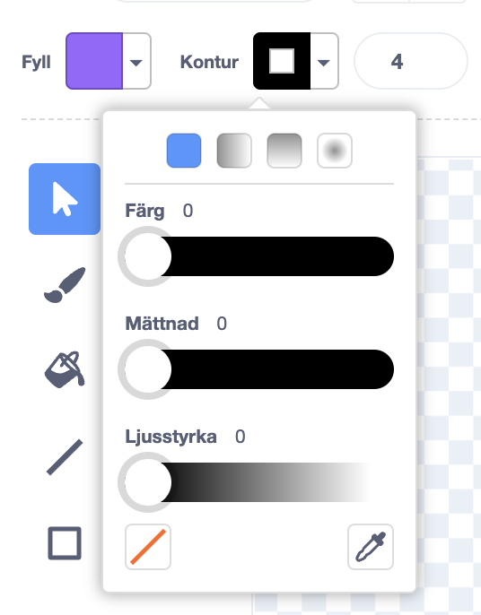 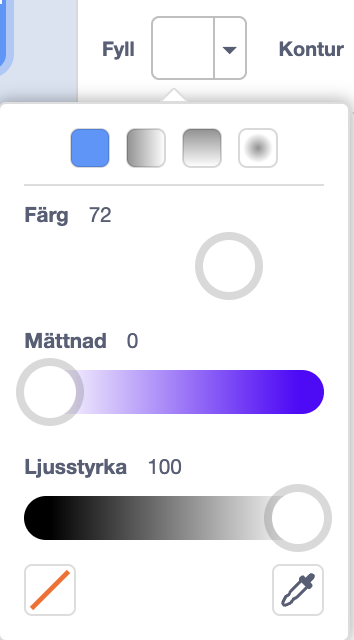

Se till att ögongloben är centrerad — flytta den så att det blå korset i klädseln överlappar med det gråa hårkorset i målarredigeraren.


Rita en mindre, perfekt cirkel och placera den på ögonglobens högra sida:


Du kan även rita cirklar inuti cirklar eller använda färg för att få olika effekter.

--- /collapse ---

--- collapse ---
---
titel: Omvandla en rund klädsel till ett ögon
---

Det finns klädslar i Scratch som du kan omvandla till roliga ögon till din karaktär.

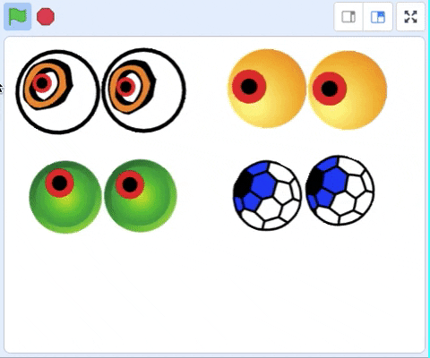

Klicka på **"Välj en klädsel"**-ikonen för att se biblioteket med Scratch-klädslar.

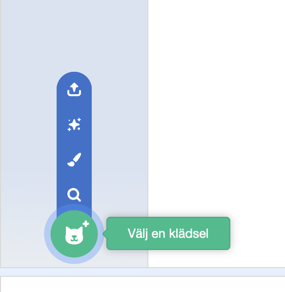

Klicka på den klädsel du vill lägga till din sprajt.

Använd målarredigeraren för att byta klädsel. Du skulle kunna lägga till cirklar, välja en annan **Fyll**färg eller ta bort delar av klädseln för att göra den till ett roligt öga.

Se till att ögonet är centrerat — flytta det så att det blå korset i klädseln överlappar med det gråa hårkorset i målarredigeraren.

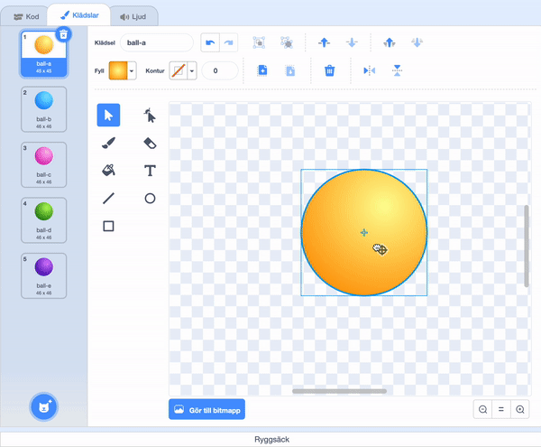

**Tips:** Den svarta pupillen och den färgade irisen måste placeras på höger sida av kostymen så att **ögongloben** följer muspekaren.

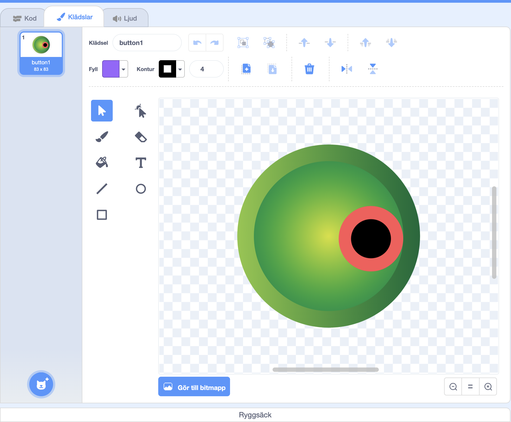

--- /collapse ---

--- /task ---

--- task ---

Ge din sprajt namnet `ögonglob` i sprajtrutan.


--- /task ---

--- task ---

Dra **ögonglob**sprajten för att placera den på scenen och ändra dess storlek så att den passar din karaktär.

--- /task ---

Låt nu ögongloben titta på `-muspekaren`{:class="block3motion"} så att användaren kan styra ditt projekt.

<p style="border-left: solid; border-width:10px; border-color: #0faeb0; background-color: aliceblue; padding: 10px;">
<span style="color: #0faeb0">**Användare**</span> betyder personen som använder projektet (inte bara gör det) och <span style="color: #0faeb0">**användarinteraktion**</span> är hur projektet reagerar på att användaren gör saker som att flytta musen och klicka på skärmen. 
</p>

### Koda din ögonglob

--- task ---

Lägg till kod som `ställer in rotationsstilen`{:class="block3motion"} till `rotera`{:class="block3motion"} för att få ögongloben `att peka mot muspekaren`{:class="block3motion"} `för alltid`{:class="block3control"}.

--- collapse ---
---
title: Gör en sprajt som pekar mot muspekaren
---

```blocks3
when flag clicked
set rotation style [all around v]
forever
point towards (mouse-pointer v)
end
```

--- /collapse ---

--- /task ---

### Lägg till en ögonglob till

--- task ---

För att lägga till ytterligare ett öga, högerklicka (eller på en surfplatta, tryck och håll kvar) på **ögonglob**sprajten i sprajtlistan och välj **kopiera**.


[[[scratch3-duplicate-sprite]]]

--- /task ---

### Testa dina roliga ögon

--- task ---

**Test:** Klicka på den gröna flaggan och att testa ditt projekt. Följer de roliga ögonen din muspekare när du flyttar runt musen?

**Tips:** Du måste inte ha muspekaren på scenen. Ögonen kommer att följa din muspekare när du fortsätter att koda i Scratch.

--- /task ---

--- task ---

**Debug:** Du kanske hittar några fel i ditt projekt som du behöver fixa. Här är några vanliga fel:

--- collapse ---
---
titel: Ögonen rör sig inte
---

Se till att du har lagt till koden till **Ögonglob**sprajterna och **klickat på den gröna flaggan**. Din kod kommer inte att köras förrän du klickar på den gröna flaggan.

--- /collapse ---

--- collapse ---
---
titel: Ögonen pekar bort från musen
---

I **Ögonglob**-klädslarna, kontrollera att pupillen är på höger sida (förbi det blåa korset i mitten av klädseln).

**Ögonglob**sprajterna har `rotationsstilen`{:class="block3motion"} `"rotera"`{:class="block3motion"} så de kan rotera i vilken riktning som helst.

När de **ögongloberna** roterar för att `peka mot`{:class="block3motion"} `muspekaren`{:class="block3motion"} kommer pupillerna att vara närmast muspekaren.

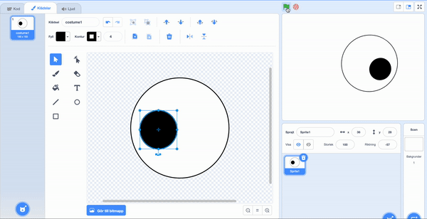


--- /collapse ---

--- collapse ---
---
titel: Ögonen hoppar runt scenen
---

Kontrollera att **ögonglob**-klädslarna är centrerade. För att centrera en klädsel, dra den så att det blåa korset i klädseln överlappar med det gråa hårkorset i målarredigeraren.

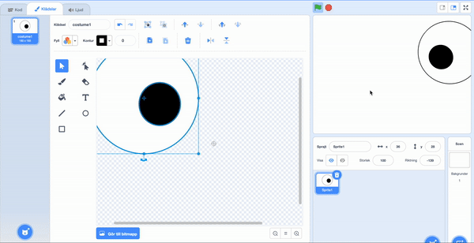


--- /collapse ---

--- collapse ---
---
titel: Karaktären är framför ögonen
---

När du drar en sprajt för att placera den på scenen flyttas den automatiskt framför de andra sprajterna.

För att få din **-karaktär**-sprajt att stanna kvar längst `bak`{:class="block3looks"}, använd:

```blocks3
when green flag clicked
forever
go to [back v] layer // behind all other sprites
```

--- /collapse ---

--- collapse ---
---
title: Karaktären och ögonen följer muspekaren
---

Lade du till ögonen som klädslar till din **karaktär** istället för som klädslar för separata sprajter? Det kan du fixa.

Ett sätt att fixa det på är att duplicera **karaktärs**sprajten och sedan byta namn på kopian till `ögonglob`. Ta sedan bort **ögonglob**klädslarna från **karaktärssprajten** och ta bort **-karaktärs** -klädslarna från **ögonglob**sprajten. Sedan kan du duplicera **ögonglob**sprajten och döpa kopian `ögonglob 2`.

Koden som `pekar mot`{:class="block3motion"} `muspekaren`{:class="block3motion"} ska vara på **ögonglob**sprajterna och inte på **karaktärs**sprajten.

--- /collapse ---

--- collapse ---
---
title: Karaktären följer muspekaren (och ögonen gör det inte)
---

Du måste lägga till `"peka mot"`{:class="block3motion"}-kod till de individuella **ögonglob**sprajterna, inte din **karaktärs**sprajt!

För att kopiera koden kan du dra koden från din **karaktärs** kodområde till **ögonglob**-sprajternas i sprajtlistan.

Du måste också ta bort koden från **karaktärs**sprajten. För att göra detta, dra koden till Blockmenyn.

--- /collapse ---

Du kanske hittar ett fel som inte finns med här. Kan du komma på hur man fixar det?

Vi hör gärna om dina fel och hur du har fixat dem. Använd **"Skicka feedback"**-knappen längst ner på denna sida och berätta för oss om du hittade ett annat fel i ditt projekt.

--- /task ---
